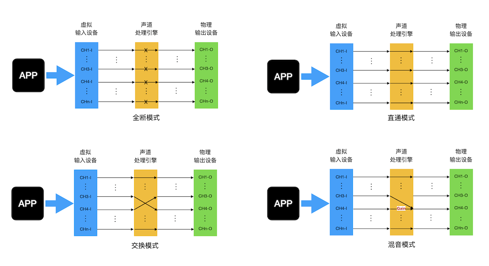

# 🎵 TopologyKeeper

[](https://developer.apple.com/macos/) [](https://swift.org/) [](https://github.com/iseku/TopologyKeeper/actions/workflows/ci.yml) [](LICENSE)

**保持你的音频输出格式**：睡眠唤醒后 HDMI/eARC 设备回落到 `2ch` 时，自动恢复为预设的 「声道数 · 位深 · 采样率」，不再需要每次手动打开「MIDI」进行设置。

**声道交换**与 **LFE 混音**：修复多声道布局错乱与重低音声道缺失。

<p align="center">
  
</p>

## 🚀 快速开始

> **系统要求**：macOS 13.0 或更高 · **通用二进制（Apple Silicon 与 Intel）**
>
> Release 中的安装包为 arm64 + x86_64 通用二进制，两种 Mac 均可直接运行。

1. 下载：[TopologyKeeper.dmg（最新版）](https://github.com/iseku/TopologyKeeper/releases/latest/download/TopologyKeeper.dmg)
2. 安装：打开 DMG，将 `TopologyKeeper.app` 拖入 `Applications`
3. 首次打开需要手动放行：本应用未使用 Apple 开发者证书签名，也未经过 Apple 公证，直接双击会被系统拦截，提示「无法打开，因为 Apple 无法检查其是否包含恶意软件」。任选一种方式放行：
   - **图形界面**：打开「系统设置 → 隐私与安全性」，在底部找到关于 `TopologyKeeper` 的拦截提示，点击「仍要打开」，再确认一次。
   - **命令行**：`xattr -dr com.apple.quarantine /Applications/TopologyKeeper.app`
4. 启动：从启动台打开 `TopologyKeeper`（状态栏出现图标，如出现麦克风授权提醒请确认）
5. 添加规则：点击状态栏图标 → 齿轮 → 「锁定规则」→ [+] 选择设备与目标格式

> 使用`声道交换` / `LFE 混音`前，先安装 [BlackHole](https://github.com/ExistentialAudio/BlackHole)：`brew install blackhole-16ch`，然后重启系统并把系统默认音频设备选择为 `BlackHole 16ch` 。

## ✨ 特性

- 🔄 **输出格式自动锁定** — 设备插拔、睡眠唤醒或格式被外部改动后，自动恢复预设格式
- 🔌 **声道处理引擎总开关** — 统一管理交换/混音通路；两个功能都关时自动进入**直通**（原样转发），不再"断链静音"
- 🔀 **声道交换** — 实时交换音频输出第 3 / 第 4 声道，修正「中置/低音炮」错误映射
- 🔉 **LFE 混音** — 将LFE声道按可调增益混入中置声道，为没有独立低音炮的音响补充低频
- ⚡ **实时处理** — 处理在实时音频回调中完成，非重采样、不写磁盘
- 🛠 **命令行工具 `tkctl`** — 无需 GUI 即可管理规则、查看状态（需自行构建，不随 dmg 分发）

## 📦 自己编译

**环境要求**：macOS 13+ · **Swift 6 工具链**（Xcode 16 及以上的 CommandLineTools 即可，无需完整 Xcode）

> 源码使用 Swift 6 语言模式（`swiftLanguageMode(.v6)`），工具链低于 6.0 会编译失败。

```bash
git clone https://github.com/iseku/TopologyKeeper.git
cd TopologyKeeper
Scripts/build_app.sh          # 构建通用 App 并打包 dmg；产物：Dist/TopologyKeeper.app 与 Dist/TopologyKeeper.dmg
open Dist/TopologyKeeper.app  # 测试运行
Scripts/test.sh               # 运行单元测试
```

## 🎮 使用

### 🔄 格式锁定

添加规则后一切自动进行：工具持续监听设备状态，只要当前格式 ≠ 预设值就自动恢复。

用于解决显示器外接HDMI/eARC音响时，MacOS不能自动切换至多声道输出格式的问题。

### 🔌 声道处理引擎（总开关）

「声道交换」与「LFE 混音」共用同一条音频通路，这条通路由**一个总开关**（配置窗口 →「声道处理」页顶部）统一管理。**首次使用默认关闭**；开启时会先检查是否已安装 BlackHole 16ch，未安装则提示先装驱动。

总开关与两个功能开关共同决定四种模式：

| 总开关 | 声道交换 | LFE 混音 | 模式     | 音频                           |
| ------ | -------- | -------- | -------- | ------------------------------ |
| 关闭   | —        | —        | 全断     | 通路不运行（音频不经过本工具） |
| 开启   | 关闭     | 关闭     | **直通** | 内容原样转发到播放设备         |
| 开启   | 开启     | 关闭     | 交换     | 交换两个声道后输出             |
| 开启   | 关闭     | 开启     | 混音     | 衰减后混入目标声道             |

其中**直通是被动进入的**（引擎开着、两个功能都关＝原样转发），无需也无法手动选择。它的意义是：此前的版本在两个功能都关时会直接断掉通路，而系统默认输出若指向 BlackHole，声音就出不来了 —— 直通保证"不处理"时音频依然正常流动。

> ⚠️ 反之，**关闭总开关 = 全断**：通路不再运行。此时若系统默认音频设备仍是 `BlackHole 16ch`，将没有任何声音。

### 🔀 声道交换

自定义交换两个音频通道输出内容，用于解决因部分软件未遵循Apple音频输出布局规范，造成 C/LFE 颠倒的问题（如 Movist Pro、WOW、Wine/Crossover 中的游戏等）。

该功能保留LFE独立输出，适合配置了独立低音炮的使用场景。

### 🔉 LFE 混音

将LFE声道衰减后混入中置声道，增强低音效果。

用于解决未配置独立低音炮时LFE信号丢失的问题，本功能亦适用于C/LFE颠倒的问题，只是LFE不再独立输出。

⚡ 混音功能与声道交换功能互斥，启用其一自动停用另一个，可视自己的需求选择开启。

⚡ 经测试，声道交换和混音功能不影响原先声道布局正确的软件，不会额外引入声道错乱。

### 🎛 声道处理引擎4种工作模式拓扑连接示意图



### 🛠 命令行工具 tkctl

> ⚠️ `tkctl` **不包含在 dmg 安装包内**，需要从源码构建后使用。

```bash
# 构建（产物：.build/spm/release/tkctl）
Scripts/build.sh --product tkctl
# 建议加入 PATH，之后即可直接调用 tkctl
export PATH="$PWD/.build/spm/release:$PATH"
```

```bash
tkctl list                 # 列出输出设备
tkctl status 0             # 当前格式 vs 目标
tkctl seed 0 8 24 96000    # 为设备 0 写入规则
tkctl mix show             # LFE 混音配置与接线图
tkctl mix verify 3         # 客观验证（内置自测信号）
tkctl swap engine          # 声道处理引擎总开关与当前模式（全断/直通/交换/混音）
tkctl help                 # 全部命令
```

## 🤝 贡献

1. Fork 本仓库
2. 创建功能分支
3. 提交问题和建议

📄 许可证

[MIT License](LICENSE)
