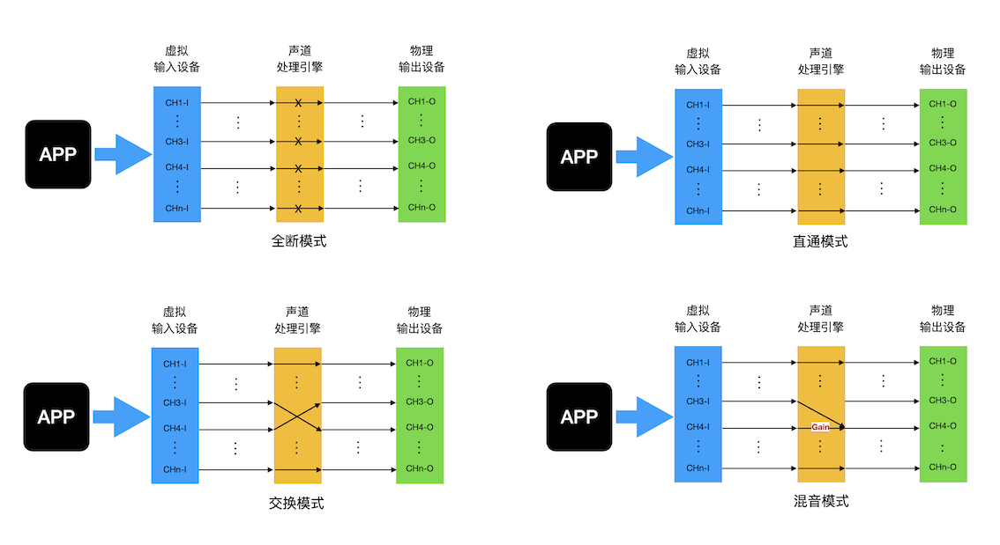

# 🎵 TopologyKeeper

[](https://developer.apple.com/macos/) [](https://swift.org/) [](https://github.com/iseku/TopologyKeeper/actions/workflows/ci.yml) [](LICENSE)

**保持你的音频输出格式**：睡眠唤醒后 HDMI/eARC 设备回落到 `2ch` 时，自动恢复为预设的 「声道数 · 位深 · 采样率」，不再需要每次手动打开「MIDI」进行设置。

**声道交换**与 **LFE 混音**：修复多声道布局错乱与重低音声道缺失。

<p align="center">
  
</p>

## 🚀 快速开始

> **系统要求**：macOS 13.0 或更高 · **通用二进制（Apple Silicon 与 Intel）**
>
> Release 中的安装包为 arm64 + x86_64 通用二进制，两种 Mac 均可直接运行。

1. 下载：[TopologyKeeper.dmg（最新版）](https://github.com/iseku/TopologyKeeper/releases/latest/download/TopologyKeeper.dmg)
2. 安装：打开 DMG，将 `TopologyKeeper.app` 拖入 `Applications`
3. 首次打开需要手动放行：本应用未使用 Apple 开发者证书签名，也未经过 Apple 公证，直接双击会被系统拦截，提示「无法打开，因为 Apple 无法检查其是否包含恶意软件」。任选一种方式放行：
   - **图形界面**：打开「系统设置 → 隐私与安全性」，在底部找到关于 `TopologyKeeper` 的拦截提示，点击「仍要打开」，再确认一次。
   - **命令行**：`xattr -dr com.apple.quarantine /Applications/TopologyKeeper.app`
4. 启动：从启动台打开 `TopologyKeeper`（状态栏出现图标，如出现麦克风授权提醒请确认）
5. 添加规则：点击状态栏图标 → 齿轮 → 「锁定规则」→ [+] 选择设备与目标格式

> 使用`声道交换` / `LFE 混音`前，先安装 [BlackHole](https://github.com/ExistentialAudio/BlackHole)：`brew install blackhole-16ch`，然后重启系统并把系统默认音频设备选择为 `BlackHole 16ch` 。

## ✨ 特性

- 🔄 **输出格式自动锁定** — 设备插拔、睡眠唤醒或格式被外部改动后，自动恢复预设格式
- 🔌 **声道处理引擎总开关** — 统一管理交换/混音通路；两个功能都关时自动进入**直通**（原样转发），不再"断链静音"
- 🔀 **声道交换** — 实时交换音频输出第 3 / 第 4 声道，修正「中置/低音炮」错误映射
- 🔉 **LFE 混音** — 将LFE声道按可调增益混入中置声道，为没有独立低音炮的音响补充低频
- ⚡ **实时处理** — 处理在实时音频回调中完成，非重采样、不写磁盘
- 🛠 **命令行工具 `tkctl`** — 无需 GUI 即可管理规则、查看状态（需自行构建，不随 dmg 分发）
- ⏱ **延迟（水位）可见** — 首页 / 设置页实时显示环形缓冲水位折算的延迟、丢旧帧数与欠载重置次数

## 📦 自己编译

**环境要求**：macOS 13+ · **Swift 6 工具链**（Xcode 16 及以上的 CommandLineTools 即可，无需完整 Xcode）

> 源码使用 Swift 6 语言模式（`swiftLanguageMode(.v6)`），工具链低于 6.0 会编译失败。

```bash
git clone https://github.com/iseku/TopologyKeeper.git
cd TopologyKeeper
Scripts/build_app.sh          # 构建通用 App 并打包 dmg；产物：Dist/TopologyKeeper.app 与 Dist/TopologyKeeper.dmg
open Dist/TopologyKeeper.app  # 测试运行
Scripts/test.sh               # 运行单元测试
```

## 🎮 使用

### 🔄 格式锁定

添加规则后一切自动进行：工具持续监听设备状态，只要当前格式 ≠ 预设值就自动恢复。

用于解决显示器外接HDMI/eARC音响时，MacOS不能自动切换至多声道输出格式的问题。

### 🔌 声道处理引擎（总开关）

「声道交换」与「LFE 混音」共用同一条音频通路，这条通路由**一个总开关**（配置窗口 →「声道处理」页顶部）统一管理。**首次使用默认关闭**；开启时会先检查是否已安装 BlackHole 16ch，未安装则提示先装驱动。

总开关与两个功能开关共同决定四种模式：

| 总开关 | 声道交换 | LFE 混音 | 模式     | 音频                           |
| ------ | -------- | -------- | -------- | ------------------------------ |
| 关闭   | —        | —        | 全断     | 通路不运行（音频不经过本工具） |
| 开启   | 关闭     | 关闭     | **直通** | 内容原样转发到播放设备         |
| 开启   | 开启     | 关闭     | 交换     | 交换两个声道后输出             |
| 开启   | 关闭     | 开启     | 混音     | 衰减后混入目标声道             |

其中**直通是被动进入的**（引擎开着、两个功能都关＝原样转发），无需也无法手动选择。它的意义是：此前的版本在两个功能都关时会直接断掉通路，而系统默认输出若指向 BlackHole，声音就出不来了 —— 直通保证"不处理"时音频依然正常流动。

> ⚠️ 反之，**关闭总开关 = 全断**：通路不再运行。此时若系统默认音频设备仍是 `BlackHole 16ch`，将没有任何声音。

### 🔀 声道交换

自定义交换两个音频通道输出内容，用于解决因部分软件未遵循Apple音频输出布局规范，造成 C/LFE 颠倒的问题（如 Movist Pro、WOW、Wine/Crossover 中的游戏等）。

该功能保留LFE独立输出，适合配置了独立低音炮的使用场景。

### 🔉 LFE 混音

将LFE声道衰减后混入中置声道，增强低音效果。

用于解决未配置独立低音炮时LFE信号丢失的问题，本功能亦适用于C/LFE颠倒的问题，只是LFE不再独立输出。

⚡ 混音功能与声道交换功能互斥，启用其一自动停用另一个，可视自己的需求选择开启。

⚡ 经测试，声道交换和混音功能不影响原先声道布局正确的软件，不会额外引入声道错乱。

### ⏱ 延迟（水位）

声道处理通路内置一小段缓冲（环形缓冲），用来吸收两端设备时钟的微小差异
（BlackHole 是虚拟设备、走软件时钟；HDMI/eARC 输出走硬件时钟，两者名义都是 48kHz，但并不严格相等）。

- **音频缓冲可选（跟随系统 / 256 / 512 帧）**：延迟的**绝对下限杠杆** —— 下限 = `2 × 缓冲 ÷ 采样率`（48kHz/512 帧 ≈ 21ms，**256 帧 ≈ 11ms**；192kHz 下再减半）。
  ⚠️ 它是全局设备属性（BlackHole 是系统默认输出），因此 TK 只在通路启动前写入、**停止/退出时恢复原值**，设备不支持时会在设置页说明原因。
- **延迟目标可调（10…50ms，默认 30ms）**：设置页有滑块，按自己的场景取舍。
  ⚠️ 实际可达下限由**音频设备的 IO 缓冲**决定（一个输出回调就要一次性读走整个缓冲，
  水位至少要装下 2 个回调）—— 本机 512 帧回调下实际最低约 **32ms**，
  所以设 10ms 时实际仍跑 32ms，界面会直接显示本机实际值。
- **目标水位默认 30ms、收敛死区 ≥ 一个回调**：超过「目标 + 死区」时按比例丢弃**最旧**的少量数据，
  把水位拉回目标；装配后的第一次回调会把启动积压一次性对齐掉。稳态延迟实测落在 **30~45ms**
  （≈ 目标 + 一个输出回调，这是"靠丢帧控延迟"的固有下限）。
  首页与设置页会实时显示「延迟（水位）」、丢旧帧数、**启动对齐**帧数与欠载重置次数。
- 界面显示的延迟是**运行平均水位**：水位在一个回调内就会跳 512 帧（刚消费完 0、
  刚写完 512），拿瞬时值当延迟显示会显得忽大忽小。要把它进一步压平只能做速率匹配
  （用 BlackHole 的可调时钟做闭环），见下方说明。
- 「静音填充」是**因数据不足而补零的帧数**（音频里极短的空洞）。它持续增长说明水位
  长期偏浅 —— 把延迟目标抬高一档即可；它保持 0 说明当前目标水位足够安全。
- 早先版本没有这一钳制，水位会长期黏在"容量的 3/4"（约 **256ms**）上，表现为
  **偶尔零点几秒的音画不同步**。而且因为 BlackHole 是系统默认输出、播放器只按
  BlackHole 上报的延迟做补偿，**这一跳的积压无法被自动补偿** —— 所以低水位不是优化，是必需。
  机制与实测数字见 [`docs/水位与延迟.md`](docs/水位与延迟.md)。
- 若「丢旧帧数」长期快速增长，说明两端时钟漂移偏大。此时可评估用 BlackHole 的
  **可调时钟**（「Audio MIDI 设置」里把时钟源设为 `Internal Adjustable`）做闭环锁相；
  TK **尚未实现**该功能，可行性 / 前置条件 / 风险见上述文档第 3 节。

### 🎛 声道处理引擎4种工作模式拓扑连接示意图



### 🛠 命令行工具 tkctl

> ⚠️ `tkctl` **不包含在 dmg 安装包内**，需要从源码构建后使用。

```bash
# 构建（**必须带 -c release**：不加它 SwiftPM 默认构建 debug，
#        产物在 .build/spm/debug/tkctl —— 照着旧文档去 release 目录取，
#        会拿到上一次 release 构建留下的陈旧二进制）
Scripts/build.sh -c release --product tkctl
# 建议加入 PATH，之后即可直接调用 tkctl
export PATH="$PWD/.build/spm/release:$PATH"
# 确认你用的是新版（能看到 latency / buffer / buffer-set 子命令）：
tkctl swap
```

> **zsh 用户**（macOS 默认 shell）：上面那行 `export PATH=...` 只对当前终端有效。
> 要长期可用，把它写进 `~/.zshrc`（用**绝对路径**，例如
> `export PATH="$HOME/Work/Projects/TopologyKeeper/.build/spm/release:$PATH"`），
> 然后 `source ~/.zshrc`。
>
> 另外 `Scripts/*.sh` 都是 **bash 脚本**（Shebang 指向 bash），直接执行即可；
> 不要用 `zsh Scripts/xxx.sh` 去跑它们 —— 那会绕过 Shebang，行为与报错都不一样。
```

```bash
tkctl list                 # 列出输出设备
tkctl status 0             # 当前格式 vs 目标
tkctl seed 0 8 24 96000    # 为设备 0 写入规则
tkctl mix show             # LFE 混音配置与接线图
tkctl mix verify 3         # 客观验证（内置自测信号）
tkctl swap engine          # 声道处理引擎总开关与当前模式（全断/直通/交换/混音）
tkctl help                 # 全部命令
```

## 🤝 贡献

1. Fork 本仓库
2. 创建功能分支
3. 提交问题和建议

📄 许可证

[MIT License](LICENSE)
